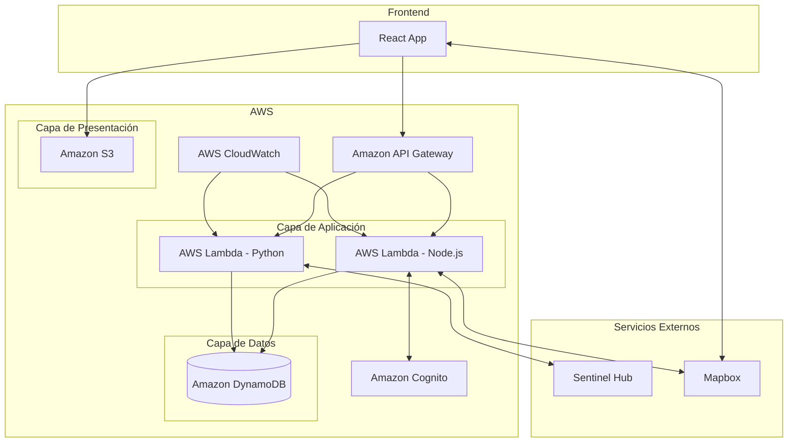
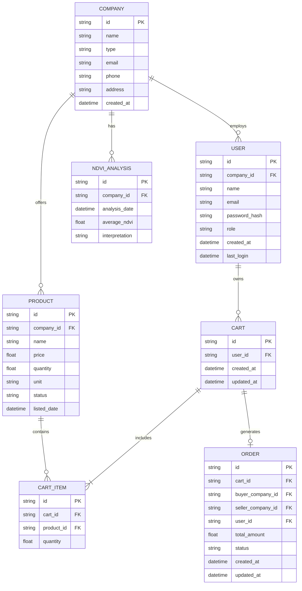

# 1. Descripción general del producto

## 1.1. Objetivo

AgriTech Connect tiene como objetivo optimizar y modernizar la cadena de suministro agrícola en Chile, conectando directamente a pequeños y medianos agricultores con compradores locales como restaurantes y mercados.

### Valor aportado:
- **Para agricultores:** Canal directo de venta, mejores márgenes de ganancia, base de clientes ampliada y herramientas de agricultura de precisión.
- **Para compradores:** Acceso a productos frescos y locales, mejora en la calidad de insumos y apoyo a productores locales.
- **Para el sector agrícola:** Fomento de tecnologías modernas y prácticas sostenibles, mejorando la eficiencia global.

### Problemas que soluciona:
- Elimina intermediarios innecesarios en la cadena de suministro.
- Reduce el desperdicio de alimentos.
- Ayuda a los agricultores a monitorear y mejorar la salud de sus cultivos.
- Simplifica el proceso de compra-venta de productos agrícolas.

## 1.2. Características y funcionalidades principales

1. **Registro y perfiles de empresa:**
   - Creación de perfiles para agricultores y compradores.
   - Gestión de múltiples usuarios por empresa con diferentes roles.

2. **Marketplace B2B:**
   - Listado de productos por agricultores (precio, cantidad, unidad).
   - Búsqueda y filtrado de productos por compradores.

3. **Carrito de compras y gestión de órdenes:**
   - Generación de órdenes de compra.
   - Sistema de aprobación de órdenes.
   - Notificaciones automáticas sobre estado de órdenes.

4. **Análisis NDVI:**
   - Generación de mapas NDVI con imágenes satelitales.
   - Visualización e interpretación básica de datos NDVI.
   - Alertas automáticas sobre cambios significativos.

5. **Dashboard personalizado:**
   - Agricultores: Resumen de ventas, productos y análisis NDVI.
   - Compradores: Historial de órdenes, favoritos y recomendaciones.

6. **Sistema de comunicación:**
   - Notificaciones in-app.
   - Integración con correo electrónico.

7. **Gestión de inventario básica:**
   - Actualización manual y automática de disponibilidad de productos.

8. **Reportes y análisis:**
   - Reportes de ventas y productos populares.
   - Tendencias de NDVI para agricultores.

9. **Interfaz responsive:**
   - Diseño adaptable para diferentes dispositivos.

10. **Seguridad y privacidad:**
    - Autenticación segura de usuarios.
    - Encriptación de datos sensibles.
    - Cumplimiento con regulaciones de privacidad.


# 2. Arquitectura del Sistema

## 2.1. Diagrama de arquitectura


La arquitectura de AgriTech Connect sigue un patrón de microservicios serverless, utilizando servicios gestionados de AWS e integraciones con servicios externos. Esta arquitectura se ha elegido por las siguientes razones:

1. **Escalabilidad:** Los servicios serverless como Lambda escalan automáticamente según la demanda.
2. **Costo-eficiencia:** Pagamos solo por los recursos que utilizamos, ideal para un MVP con tráfico variable.
3. **Mantenimiento reducido:** AWS gestiona la infraestructura subyacente, permitiéndonos centrarnos en el desarrollo de características.
4. **Flexibilidad:** Podemos usar diferentes lenguajes (Node.js, Python) según las necesidades de cada componente.

### Beneficios principales:

- Rápido desarrollo y despliegue del MVP.
- Costos iniciales bajos, aprovechando la capa gratuita de AWS.
- Fácil integración con servicios externos como Sentinel Hub y Mapbox.
- Alta disponibilidad y tolerancia a fallos gestionada por AWS.

### Sacrificios o déficits:

- Posible latencia en operaciones que requieren iniciar instancias de Lambda (cold starts).
- Limitaciones en tiempo de ejecución para funciones Lambda (máximo 15 minutos).
- Menor control sobre la infraestructura subyacente.

## 2.2. Descripción de componentes principales

1. **Frontend (React App)**
   - Tecnología: React
   - Descripción: Aplicación de página única (SPA) que proporciona la interfaz de usuario para agricultores y compradores.
   - Responsabilidades: Renderizar la UI, manejar interacciones del usuario, comunicarse con el backend a través de API Gateway.

2. **Amazon S3**
   - Tecnología: Servicio de almacenamiento de objetos de AWS
   - Descripción: Aloja los archivos estáticos del frontend React.
   - Responsabilidades: Servir el contenido estático de la aplicación web.

3. **AWS Lambda (Node.js)**
   - Tecnología: Servicio de computación serverless de AWS, Node.js
   - Descripción: Maneja la lógica de negocio principal del backend.
   - Responsabilidades: Procesar solicitudes API, interactuar con DynamoDB, manejar autenticación.

4. **AWS Lambda (Python)**
   - Tecnología: Servicio de computación serverless de AWS, Python
   - Descripción: Se encarga del procesamiento de imágenes y cálculos NDVI.
   - Responsabilidades: Obtener y procesar imágenes de Sentinel Hub, calcular índices NDVI.

5. **Amazon DynamoDB**
   - Tecnología: Base de datos NoSQL serverless de AWS
   - Descripción: Almacena todos los datos de la aplicación.
   - Responsabilidades: Persistencia de datos de usuarios, productos, resultados NDVI, etc.

6. **Amazon API Gateway**
   - Tecnología: Servicio de gestión de API de AWS
   - Descripción: Punto de entrada para todas las solicitudes API del frontend.
   - Responsabilidades: Enrutar solicitudes a las funciones Lambda apropiadas, manejar autorización.

7. **Amazon Cognito**
   - Tecnología: Servicio de autenticación y autorización de AWS
   - Descripción: Maneja la autenticación de usuarios y la gestión de sesiones.
   - Responsabilidades: Registro de usuarios, inicio de sesión, tokens de autenticación.

8. **AWS CloudWatch**
   - Tecnología: Servicio de monitoreo y observabilidad de AWS
   - Descripción: Proporciona monitoreo y logging para todos los componentes de AWS.
   - Responsabilidades: Recopilar logs, métricas, crear alarmas.

9. **Sentinel Hub**
   - Tecnología: Proveedor de imágenes satelitales
   - Descripción: Proporciona acceso a imágenes satelitales para análisis NDVI.
   - Responsabilidades: Entregar imágenes multiespectrales bajo demanda.

10. **Mapbox**
    - Tecnología: Servicio de mapas y geolocalización
    - Descripción: Proporciona funcionalidades de mapeo y geolocalización.
    - Responsabilidades: Renderizar mapas, geocodificación, cálculo de rutas.


# 3. Modelo de Datos

## 3.1. Diagrama del modelo de datos



## 3.2. Descripción de entidades principales

### COMPANY
* **id** (string, PK): Identificador único de la compañía
* **name** (string, NOT NULL): Nombre de la compañía
* **type** (string, NOT NULL): Tipo de compañía (e.g., "agricultor", "comprador")
* **email** (string, UNIQUE, NOT NULL): Correo electrónico de contacto principal
* **phone** (string): Número de teléfono
* **address** (string): Dirección física
* **created_at** (datetime, NOT NULL): Fecha y hora de creación del registro

Relaciones:
* Una COMPANY puede tener muchos USER (1:N)
* Una COMPANY puede ofrecer muchos PRODUCT (1:N)
* Una COMPANY puede tener muchos NDVI_ANALYSIS (1:N)

### USER
* **id** (string, PK): Identificador único del usuario
* **company_id** (string, FK, NOT NULL): ID de la compañía a la que pertenece el usuario
* **name** (string, NOT NULL): Nombre completo del usuario
* **email** (string, UNIQUE, NOT NULL): Correo electrónico del usuario
* **password_hash** (string, NOT NULL): Hash de la contraseña
* **role** (string, NOT NULL): Rol del usuario en la compañía
* **created_at** (datetime, NOT NULL): Fecha y hora de creación del usuario
* **last_login** (datetime): Última fecha y hora de inicio de sesión

Relaciones:
* Un USER pertenece a una COMPANY (N:1)
* Un USER puede tener muchos CART (1:N)

### PRODUCT
* **id** (string, PK): Identificador único del producto
* **company_id** (string, FK, NOT NULL): ID de la compañía que ofrece el producto
* **name** (string, NOT NULL): Nombre del producto
* **price** (float, NOT NULL): Precio por unidad
* **quantity** (float, NOT NULL): Cantidad disponible
* **unit** (string, NOT NULL): Unidad de medida (e.g., "kg", "unidad")
* **status** (string, NOT NULL): Estado del producto (e.g., "disponible", "agotado")
* **listed_date** (datetime, NOT NULL): Fecha y hora en que se listó el producto

Relaciones:
* Un PRODUCT es ofrecido por una COMPANY (N:1)
* Un PRODUCT puede estar en muchos CART_ITEM (1:N)

### NDVI_ANALYSIS
* **id** (string, PK): Identificador único del análisis NDVI
* **company_id** (string, FK, NOT NULL): ID de la compañía asociada al análisis
* **analysis_date** (datetime, NOT NULL): Fecha y hora del análisis
* **average_ndvi** (float, NOT NULL): Valor promedio del NDVI
* **interpretation** (string): Interpretación textual del resultado del NDVI

Relaciones:
* Un NDVI_ANALYSIS pertenece a una COMPANY (N:1)

### CART
* **id** (string, PK): Identificador único del carrito
* **user_id** (string, FK, NOT NULL): ID del usuario dueño del carrito
* **created_at** (datetime, NOT NULL): Fecha y hora de creación del carrito
* **updated_at** (datetime, NOT NULL): Última fecha y hora de actualización del carrito

Relaciones:
* Un CART pertenece a un USER (N:1)
* Un CART puede tener muchos CART_ITEM (1:N)
* Un CART puede generar una ORDER (1:1)

### CART_ITEM
* **id** (string, PK): Identificador único del ítem en el carrito
* **cart_id** (string, FK, NOT NULL): ID del carrito al que pertenece
* **product_id** (string, FK, NOT NULL): ID del producto en el carrito
* **quantity** (float, NOT NULL): Cantidad del producto en el carrito

Relaciones:
* Un CART_ITEM pertenece a un CART (N:1)
* Un CART_ITEM se refiere a un PRODUCT (N:1)

### ORDER
* **id** (string, PK): Identificador único de la orden
* **cart_id** (string, FK, NOT NULL): ID del carrito que generó la orden
* **buyer_company_id** (string, FK, NOT NULL): ID de la compañía compradora
* **seller_company_id** (string, FK, NOT NULL): ID de la compañía vendedora
* **user_id** (string, FK, NOT NULL): ID del usuario que generó la orden
* **total_amount** (float, NOT NULL): Monto total de la orden
* **status** (string, NOT NULL): Estado de la orden (e.g., "pendiente", "aprobada", "rechazada")
* **created_at** (datetime, NOT NULL): Fecha y hora de creación de la orden
* **updated_at** (datetime, NOT NULL): Última fecha y hora de actualización de la orden

Relaciones:
* Una ORDER es generada por un CART (N:1)
* Una ORDER está asociada a una compañía compradora (N:1)
* Una ORDER está asociada a una compañía vendedora (N:1)
* Una ORDER es creada por un USER (N:1)


# 4. Especificación de la API

A continuación se describen los tres endpoints principales de la API de AgriTech Connect en formato OpenAPI:

```yaml
openapi: 3.0.0
info:
  title: AgriTech Connect API
  version: 1.0.0
  description: API para la plataforma AgriTech Connect

paths:
  /products:
    get:
      summary: Obtiene una lista de productos
      parameters:
        - in: query
          name: page
          schema:
            type: integer
          description: Número de página para la paginación
        - in: query
          name: limit
          schema:
            type: integer
          description: Cantidad de productos por página
      responses:
        '200':
          description: Lista de productos obtenida exitosamente
          content:
            application/json:    
              schema:
                type: object
                properties:
                  products:
                    type: array
                    items:
                      $ref: '#/components/schemas/Product'
                  totalPages:
                    type: integer
                  currentPage:
                    type: integer
        '400':
          description: Parámetros de consulta inválidos

  /orders:
    post:
      summary: Crea una nueva orden
      requestBody:
        required: true
        content:
          application/json:
            schema:
              $ref: '#/components/schemas/OrderInput'
      responses:
        '201':
          description: Orden creada exitosamente
          content:
            application/json:
              schema:
                $ref: '#/components/schemas/Order'
        '400':
          description: Datos de entrada inválidos
        '401':
          description: No autorizado

  /ndvi-analysis/{companyId}:
    get:
      summary: Obtiene el análisis NDVI más reciente para una compañía
      parameters:
        - in: path
          name: companyId
          required: true
          schema:
            type: string
      responses:
        '200':
          description: Análisis NDVI obtenido exitosamente
          content:
            application/json:
              schema:
                $ref: '#/components/schemas/NDVIAnalysis'
        '404':
          description: Compañía no encontrada o sin análisis NDVI
        '401':
          description: No autorizado

components:
  schemas:
    Product:
      type: object
      properties:
        id:
          type: string
        name:
          type: string
        price:
          type: number
        quantity:
          type: number
        unit:
          type: string
        status:
          type: string
        companyId:
          type: string

    OrderInput:
      type: object
      properties:
        cartId:
          type: string
        buyerCompanyId:
          type: string
        sellerCompanyId:
          type: string

    Order:
      type: object
      properties:
        id:
          type: string
        cartId:
          type: string
        buyerCompanyId:
          type: string
        sellerCompanyId:
          type: string
        userId:
          type: string
        totalAmount:
          type: number
        status:
          type: string
        createdAt:
          type: string
          format: date-time

    NDVIAnalysis:
      type: object
      properties:
        id:
          type: string
        companyId:
          type: string
        analysisDate:
          type: string
          format: date-time
        averageNDVI:
          type: number
        interpretation:
          type: string
```

## Ejemplos de petición y respuesta

### 1. Obtener lista de productos

**Petición:**
```http
GET /products?page=1&limit=10
```

**Respuesta:**
```json
{
  "products": [
    {
      "id": "prod-001",
      "name": "Manzanas Orgánicas",
      "price": 2.5,
      "quantity": 100,
      "unit": "kg",
      "status": "disponible",
      "companyId": "comp-001"
    },
    {
      "id": "prod-002",
      "name": "Tomates Cherry",
      "price": 3.0,
      "quantity": 50,
      "unit": "kg",
      "status": "disponible",
      "companyId": "comp-002"
    }
  ],
  "totalPages": 5,
  "currentPage": 1
}
```

### 2. Crear una nueva orden

**Petición:**
```http
POST /orders
Content-Type: application/json

{
  "cartId": "cart-001",
  "buyerCompanyId": "comp-003",
  "sellerCompanyId": "comp-001"
}
```

**Respuesta:**
```json
{
  "id": "order-001",
  "cartId": "cart-001",
  "buyerCompanyId": "comp-003",
  "sellerCompanyId": "comp-001",
  "userId": "user-001",
  "totalAmount": 250.0,
  "status": "pendiente",
  "createdAt": "2023-09-01T14:30:00Z"
}
```

### 3. Obtener análisis NDVI para una compañía

**Petición:**
```http
GET /ndvi-analysis/comp-001
```

**Respuesta:**
```json
{
  "id": "ndvi-001",
  "companyId": "comp-001",
  "analysisDate": "2023-08-30T10:00:00Z",
  "averageNDVI": 0.75,
  "interpretation": "La salud del cultivo es buena. Se recomienda mantener las prácticas actuales de riego y fertilización."
}
```

# 5. Historias de Usuario


## Agricultores

### Historia de Usuario 1: Registro de empresa agrícola
Como agricultor,
Quiero registrar mi empresa en la plataforma,
Para poder ofrecer mis productos a compradores.

**Criterios de aceptación:**
- Puedo ingresar el nombre de mi empresa, dirección y correo electrónico.
- Debo aceptar los términos y condiciones de la plataforma.
- Recibo un correo de confirmación tras el registro exitoso.

### Historia de Usuario 2: Listado de productos
Como agricultor registrado,
Quiero listar mis productos en la plataforma,
Para que los compradores puedan verlos.

**Criterios de aceptación:**
- Puedo agregar un nuevo producto con nombre, precio, cantidad y unidad.
- Puedo subir una imagen del producto.
- Puedo editar o eliminar mis productos listados.

### Historia de Usuario 3: Dibujar campos en mapa
Como agricultor registrado,
Quiero dibujar mis campos en un mapa interactivo,
Para definir las áreas para el análisis NDVI.

**Criterios de aceptación:**
- Puedo acceder a una interfaz de mapa interactivo.
- Puedo dibujar polígonos para delimitar mis campos.
- Puedo guardar los campos dibujados.

### Historia de Usuario 4: Nombrar y especificar campos
Como agricultor registrado,
Quiero nombrar mis campos y especificar el tipo de cultivo,
Para organizar mejor mis áreas de cultivo.

**Criterios de aceptación:**
- Puedo asignar un nombre a cada campo dibujado.
- Puedo especificar el tipo de cultivo para cada campo.
- Puedo editar esta información después de guardarla.

### Historia de Usuario 5: Ver análisis NDVI
Como agricultor registrado,
Quiero ver el análisis NDVI de un campo específico,
Para evaluar la salud de mis cultivos.

**Criterios de aceptación:**
- Puedo seleccionar un campo para ver su análisis NDVI.
- Veo un mapa con colores que indican la salud del cultivo.
- Veo una interpretación simple del análisis.

### Historia de Usuario 6: Historial de NDVI
Como agricultor registrado,
Quiero ver el historial de análisis NDVI,
Para tracking de la salud de mis cultivos en el tiempo.

**Criterios de aceptación:**
- Puedo ver análisis NDVI de los últimos 3 meses.
- Puedo comparar análisis de diferentes fechas.
- Puedo descargar un informe PDF del historial.

## Compradores

### Historia de Usuario 7: Búsqueda de productos
Como visitante de la plataforma,
Quiero buscar productos sin registrarme,
Para encontrar los insumos que necesito rápidamente.

**Criterios de aceptación:**
- Puedo buscar por nombre, categoría o productor sin iniciar sesión.
- Puedo filtrar resultados por precio y disponibilidad.
- Puedo ver detalles de cada producto.

### Historia de Usuario 8: Agregar al carrito
Como visitante de la plataforma,
Quiero agregar productos a un carrito,
Para preparar mi compra.

**Criterios de aceptación:**
- Puedo agregar productos al carrito sin iniciar sesión.
- Puedo especificar la cantidad de cada producto.
- Puedo ver un resumen de mi carrito en cualquier momento.

### Historia de Usuario 9: Crear orden de compra
Como visitante con productos en el carrito,
Quiero crear una orden de compra,
Para adquirir los productos seleccionados.

**Criterios de aceptación:**
- Puedo revisar el resumen de mi orden antes de confirmar.
- Puedo proporcionar un correo electrónico para la confirmación.
- Recibo un número de orden tras la confirmación.

### Historia de Usuario 10: Seguimiento de orden
Como comprador con una orden realizada,
Quiero ver el estado de mi orden,
Para saber cuándo esperar mis productos.

**Criterios de aceptación:**
- Puedo acceder al estado de mi orden con número de orden y correo.
- Veo el estado actual (pendiente, aprobada, en camino, entregada).
- Recibo notificaciones por email de cambios en el estado.

## Administrador

### Historia de Usuario 11: Gestión de usuarios
Como administrador de la plataforma,
Quiero gestionar las cuentas de usuarios,
Para mantener la integridad de la plataforma.

**Criterios de aceptación:**
- Puedo ver una lista de todas las empresas y usuarios.
- Puedo desactivar o reactivar cuentas.
- Puedo ver y modificar detalles de las cuentas.

### Historia de Usuario 12: Monitoreo de transacciones
Como administrador de la plataforma,
Quiero monitorear las transacciones,
Para asegurar el correcto funcionamiento y resolver disputas.

**Criterios de aceptación:**
- Veo un resumen de transacciones en un período de tiempo.
- Puedo filtrar por estado, monto, comprador o vendedor.
- Puedo ver detalles completos de cada transacción.


# 6. Tickets de Trabajo

## Ticket 1: Backend - Implementar API para listado de productos

**Tipo:** Feature
**Componente:** Backend
**Estimación:** 8 horas
**Prioridad:** Alta

### Descripción
Implementar un endpoint en la API RESTful para obtener una lista paginada de productos. Este endpoint debe permitir filtrar productos por nombre, categoría y productor, así como ordenar los resultados por precio o fecha de listado.

### Criterios de Aceptación
1. El endpoint debe ser accesible en `GET /api/v1/products`
2. Debe soportar los siguientes parámetros de consulta:
   - `page` (número de página, por defecto 1)
   - `limit` (número de productos por página, por defecto 20, máximo 100)
   - `search` (término de búsqueda para nombre de producto)
   - `category` (filtro por categoría de producto)
   - `producer` (filtro por ID de productor)
   - `sort` (campo de ordenamiento: "price" o "date")
   - `order` (dirección de ordenamiento: "asc" o "desc")
3. La respuesta debe incluir:
   - Lista de productos con sus detalles (id, nombre, precio, cantidad, unidad, productor)
   - Número total de productos que coinciden con los filtros
   - Número total de páginas
   - Página actual
4. Debe implementar manejo de errores para parámetros inválidos
5. Debe incluir pruebas unitarias y de integración

### Tareas
1. Diseñar la estructura de la respuesta JSON
2. Implementar el controlador para el endpoint en Express.js
3. Crear consultas a DynamoDB para filtrar y paginar productos
4. Implementar lógica de ordenamiento
5. Añadir validación de parámetros de consulta
6. Implementar manejo de errores
7. Escribir pruebas unitarias para el controlador
8. Escribir pruebas de integración para el endpoint
9. Documentar el endpoint en el archivo README del proyecto

### Notas Técnicas
- Utilizar el SDK de AWS para DynamoDB
- Implementar caching con Redis para mejorar el rendimiento de búsquedas frecuentes
- Asegurar que las consultas a DynamoDB estén optimizadas para reducir el consumo de RCU

### Definición de Hecho
- El código pasa todas las pruebas unitarias y de integración
- El endpoint está documentado en el README y en la especificación OpenAPI
- El código ha sido revisado y aprobado por al menos un desarrollador senior
- El endpoint funciona correctamente en el ambiente de staging

---

## Ticket 2: Frontend - Implementar página de listado de productos

**Tipo:** Feature
**Componente:** Frontend
**Estimación:** 16 horas
**Prioridad:** Alta

### Descripción
Crear una página de listado de productos que muestre los productos disponibles, permita búsqueda y filtrado, y proporcione una experiencia de usuario fluida y responsiva.

### Criterios de Aceptación
1. La página debe mostrar una lista de productos con:
   - Imagen del producto
   - Nombre del producto
   - Precio
   - Nombre del productor
   - Botón para añadir al carrito
2. Implementar una barra de búsqueda para filtrar productos por nombre
3. Incluir filtros laterales para:
   - Categoría de producto
   - Rango de precios
   - Productor
4. Implementar ordenamiento por precio (ascendente/descendente) y fecha de listado
5. La página debe ser responsiva y funcionar bien en dispositivos móviles y de escritorio
6. Implementar paginación o scroll infinito para cargar más productos
7. Mostrar un estado de carga mientras se obtienen los productos
8. Manejar y mostrar estados de error apropiadamente

### Tareas
1. Crear un nuevo componente React para la página de listado de productos
2. Implementar la estructura HTML/JSX básica de la página
3. Crear componentes reutilizables para:
   - Tarjeta de producto
   - Barra de búsqueda
   - Filtros laterales
   - Componente de ordenamiento
4. Implementar la lógica de estado usando React Hooks o Redux
5. Integrar con la API de backend para obtener los datos de productos
6. Implementar la lógica de filtrado y ordenamiento en el frontend
7. Diseñar y aplicar estilos CSS utilizando un enfoque mobile-first
8. Implementar paginación o scroll infinito
9. Añadir animaciones y transiciones para mejorar la UX
10. Escribir pruebas unitarias para los componentes principales
11. Realizar pruebas de usabilidad y ajustar según el feedback

### Notas Técnicas
- Utilizar React Hooks para el manejo de estado
- Implementar code-splitting para optimizar el rendimiento
- Utilizar Styled Components o CSS Modules para los estilos
- Asegurar que todos los componentes sean accesibles (WCAG 2.1)

### Definición de Hecho
- Todos los criterios de aceptación se cumplen
- El código pasa todas las pruebas unitarias
- La página es completamente responsiva y funciona en los navegadores principales
- El código ha sido revisado y aprobado por al menos un desarrollador senior
- La funcionalidad ha sido probada y aprobada por QA

---

## Ticket 3: Base de Datos - Optimizar consultas de productos en DynamoDB

**Tipo:** Optimización
**Componente:** Base de Datos
**Estimación:** 12 horas
**Prioridad:** Media

### Descripción
Optimizar la estructura y las consultas de la tabla de productos en DynamoDB para mejorar el rendimiento y reducir los costos de las operaciones de lectura, especialmente para las consultas de listado y búsqueda de productos.

### Criterios de Aceptación
1. Rediseñar la estructura de la tabla de productos para soportar eficientemente:
   - Búsqueda por nombre de producto
   - Filtrado por categoría y productor
   - Ordenamiento por precio y fecha de listado
2. Implementar un índice global secundario (GSI) para optimizar las consultas frecuentes
3. Reducir el consumo de RCU (Read Capacity Units) en al menos un 30% para las operaciones de listado
4. Mantener el rendimiento de las operaciones de escritura
5. Asegurar que todas las consultas existentes sigan funcionando correctamente
6. Documentar la nueva estructura de la tabla y las mejores prácticas para consultas

### Tareas
1. Analizar los patrones de acceso actuales y las consultas más frecuentes
2. Diseñar una nueva estructura de clave primaria y GSI
3. Crear un plan de migración de datos
4. Implementar y probar la nueva estructura en un ambiente de desarrollo
5. Actualizar las consultas en el código del backend para utilizar la nueva estructura
6. Realizar pruebas de carga para verificar la mejora en el rendimiento
7. Documentar la nueva estructura y las prácticas recomendadas para consultas
8. Crear un script de migración para los datos existentes
9. Planificar y ejecutar la migración en producción
10. Monitorear el rendimiento post-migración y ajustar si es necesario

### Notas Técnicas
- Considerar el uso de tipos de datos binarios para reducir el tamaño de los items
- Implementar TTL (Time To Live) para productos obsoletos o agotados
- Utilizar herramientas de AWS como DynamoDB Streams para la migración de datos
- Considerar la implementación de caching con DAX o ElastiCache para consultas frecuentes

### Definición de Hecho
- La nueva estructura de la tabla está implementada y todos los datos migrados
- Las consultas de listado y búsqueda muestran una mejora de rendimiento verificable
- El consumo de RCU se ha reducido en al menos un 30%
- Todas las funcionalidades existentes siguen operando correctamente
- La nueva estructura y las prácticas de consulta están documentadas
- El equipo de desarrollo ha sido capacitado sobre la nueva estructura y prácticas óptimas