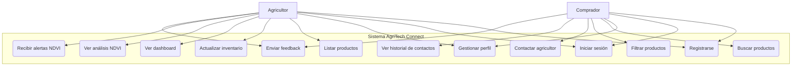
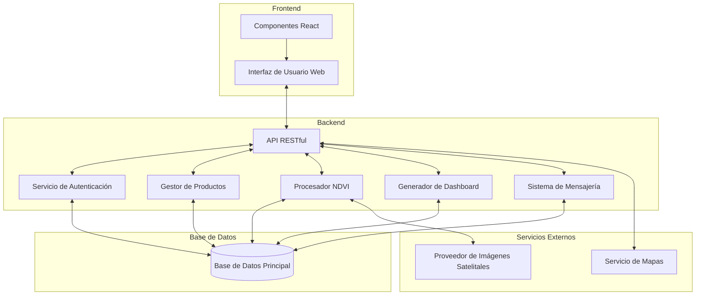
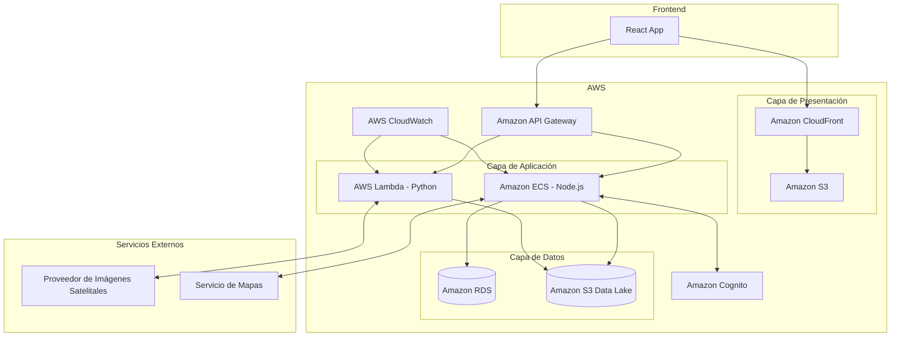
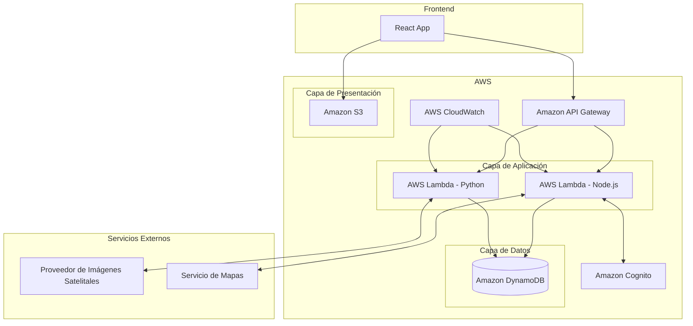
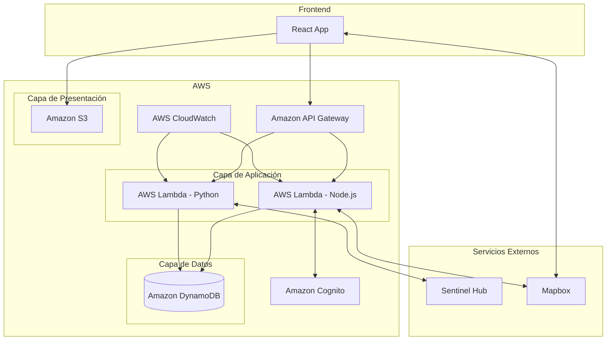

### Yo:

Bien, necesitaremos llevar esto a un software, podríamos comenzar con identificar partes clave del sistema y las componentes o módulos que necesitaremos para llevarlo a cabo. Comencemos la etapa de análisis

### Claude:

Entendido. Vamos a iniciar la etapa de análisis para el MVP de AgriTech Connect, identificando las partes clave del sistema y los componentes o módulos necesarios para implementarlo. Este análisis nos ayudará a estructurar el desarrollo del software.

1. Arquitectura general del sistema:

a) Frontend:
   - Aplicación web responsive
   - Interfaces de usuario para agricultores y compradores

b) Backend:
   - API RESTful
   - Base de datos
   - Servicios de procesamiento de imágenes satelitales

c) Servicios externos:
   - Proveedor de imágenes satelitales para NDVI

2. Módulos principales:

a) Módulo de Autenticación y Gestión de Usuarios:
   - Registro de usuarios (agricultores y compradores)
   - Inicio de sesión
   - Gestión de perfiles

b) Módulo de Catálogo de Productos:
   - Listado de productos
   - Búsqueda y filtrado
   - Gestión de inventario básico

c) Módulo de Comunicación:
   - Sistema de mensajería interna
   - Notificaciones

d) Módulo de Análisis NDVI:
   - Integración con proveedor de imágenes satelitales
   - Procesamiento de imágenes para generar mapas NDVI
   - Almacenamiento y recuperación de datos históricos NDVI

e) Módulo de Dashboard:
   - Generación de gráficos y estadísticas básicas
   - Visualización de datos NDVI
   - Gestión de alertas

f) Módulo de Feedback:
   - Recolección y almacenamiento de comentarios de usuarios

3. Componentes técnicos clave:

a) Base de datos:
   - Almacenamiento de perfiles de usuario
   - Catálogo de productos
   - Datos de transacciones y comunicaciones
   - Historial de NDVI

b) Servidor de aplicaciones:
   - Manejo de lógica de negocio
   - Procesamiento de solicitudes API

c) Sistema de procesamiento de imágenes:
   - Análisis de imágenes satelitales
   - Generación de mapas NDVI

d) Sistema de caché:
   - Almacenamiento en caché de datos frecuentemente accedidos para mejorar el rendimiento

e) Sistema de autenticación y autorización:
   - Gestión de sesiones de usuario
   - Control de acceso basado en roles

4. Integraciones externas:

a) Proveedor de imágenes satelitales:
   - API para obtener imágenes satelitales actualizadas

b) Servicios de mapas:
   - Para visualización de ubicaciones de agricultores y compradores

5. Consideraciones de seguridad:

a) Encriptación de datos sensibles
b) Implementación de HTTPS
c) Protección contra ataques comunes (SQL injection, XSS, CSRF)

6. Escalabilidad y rendimiento:

a) Diseño modular para facilitar futuras expansiones
b) Optimización de consultas a la base de datos
c) Implementación de sistemas de caché donde sea apropiado

7. Interfaz de usuario:

a) Diseño responsive para acceso desde diferentes dispositivos
b) Interfaz intuitiva para carga y visualización de datos NDVI
c) Dashboards personalizados para agricultores y compradores

Este análisis proporciona una visión general de los componentes clave necesarios para implementar el MVP de AgriTech Connect. El siguiente paso sería profundizar en cada módulo, definir los requisitos específicos y comenzar con el diseño detallado de la arquitectura del sistema.

### Yo:
podríamos generar un diagrama de casos de uso del sistema en formato mermeid

### Claude:
Claro, puedo ayudarte a crear un diagrama de casos de uso del sistema utilizando Mermaid. Este diagrama mostrará las principales interacciones de los usuarios (agricultores y compradores) con el sistema AgriTech Connect.

Este diagrama de casos de uso muestra las principales interacciones que los agricultores y compradores pueden tener con el sistema AgriTech Connect. Aquí está una breve explicación de los casos de uso representados:

1. Comunes para Agricultores y Compradores:
   - Registrarse
   - Iniciar sesión
   - Gestionar perfil
   - Enviar feedback

2. Específicos para Agricultores:
   - Listar productos
   - Actualizar inventario
   - Ver dashboard
   - Ver análisis NDVI
   - Recibir alertas NDVI

3. Específicos para Compradores:
   - Buscar productos
   - Filtrar productos
   - Contactar agricultor
   - Ver historial de contactos

Este diagrama proporciona una visión general clara de las funcionalidades principales del sistema y cómo los diferentes tipos de usuarios interactúan con él. Es una herramienta útil para comunicar el alcance del sistema a los stakeholders y puede servir como base para el desarrollo de historias de usuario más detalladas.

¿Te gustaría que profundizáramos en algún caso de uso en particular o que pasáramos a otra fase del análisis del sistema?

### Yo:
Que te parece ahora generemos un diagrama de componentes para ir planificando la arquitectura

### Claude:

Excelente idea. Un diagrama de componentes nos ayudará a visualizar la estructura de alto nivel del sistema y cómo interactúan sus diferentes partes. Vamos a crear un diagrama de componentes para AgriTech Connect utilizando Mermaid.

Este diagrama de componentes muestra la arquitectura de alto nivel de AgriTech Connect. Aquí está una explicación de los componentes y sus interacciones:

1. Frontend:
   - Interfaz de Usuario Web: La aplicación web principal que los usuarios interactúan directamente.
   - Componentes React: Componentes reutilizables para construir la interfaz de usuario.

2. Backend:
   - API RESTful: El punto de entrada principal para las solicitudes del frontend.
   - Servicio de Autenticación: Maneja el registro, inicio de sesión y gestión de sesiones.
   - Gestor de Productos: Maneja la lógica relacionada con el listado, búsqueda y filtrado de productos.
   - Procesador NDVI: Se encarga de procesar las imágenes satelitales y generar los análisis NDVI.
   - Generador de Dashboard: Crea y actualiza los dashboards para agricultores y compradores.
   - Sistema de Mensajería: Maneja la comunicación entre agricultores y compradores.

3. Base de Datos:
   - Base de Datos Principal: Almacena todos los datos del sistema, incluyendo perfiles de usuario, productos, mensajes y datos NDVI.

4. Servicios Externos:
   - Proveedor de Imágenes Satelitales: Proporciona las imágenes necesarias para el análisis NDVI.
   - Servicio de Mapas: Ofrece funcionalidades de mapeo para mostrar ubicaciones de agricultores y compradores.

Las flechas indican las interacciones entre los componentes. Por ejemplo, la Interfaz de Usuario Web se comunica con el backend a través de la API RESTful, y los componentes del backend interactúan con la Base de Datos Principal para almacenar y recuperar datos.

Este diagrama de componentes nos da una visión clara de la estructura del sistema y cómo se relacionan sus diferentes partes. Es una herramienta útil para planificar el desarrollo, asignar responsabilidades a diferentes equipos y asegurar que todos los componentes necesarios estén considerados en la arquitectura.

¿Te gustaría que profundizáramos en algún componente específico o que pasáramos a otra fase del diseño de la arquitectura?

### Yo:

Por conocimientos tecnicos, me gustaría usar react para el frontend, nodejs para el backend y python para los servicios que sea necesario, además usaremos aws como proveedor de infraestructura

### Claude:

Entendido. Esas son excelentes elecciones tecnológicas que se alinean bien con las necesidades de AgriTech Connect. Vamos a ajustar nuestro enfoque de arquitectura para incorporar estas tecnologías específicas y el uso de AWS como proveedor de infraestructura. Te presentaré un diagrama de arquitectura actualizado que refleje estas decisiones.

Explicación de los componentes y su relación con las tecnologías elegidas:

1. Frontend:
   - React App: La aplicación frontend desarrollada en React.

2. AWS (Amazon Web Services):
   a) Capa de Presentación:
      - Amazon S3: Aloja los archivos estáticos de la aplicación React.
      - Amazon CloudFront: CDN para distribuir la aplicación globalmente con baja latencia.

   b) Capa de Aplicación:
      - Amazon ECS (Elastic Container Service) - Node.js: Ejecuta contenedores Docker con la aplicación backend en Node.js.
      - AWS Lambda - Python: Funciones serverless para procesar imágenes NDVI y otras tareas intensivas en Python.

   c) Capa de Datos:
      - Amazon RDS: Base de datos relacional para almacenar datos estructurados (perfiles de usuario, productos, etc.).
      - Amazon S3 Data Lake: Almacenamiento de objetos para datos no estructurados (imágenes satelitales, mapas NDVI procesados).

   d) Servicios de Soporte:
      - Amazon API Gateway: Gestiona y asegura las API RESTful.
      - Amazon Cognito: Maneja la autenticación y autorización de usuarios.
      - AWS CloudWatch: Monitoreo y logging de la aplicación.

3. Servicios Externos:
   - Proveedor de Imágenes Satelitales: Se integra con las funciones Lambda para el procesamiento NDVI.
   - Servicio de Mapas: Se integra con el backend de Node.js para proporcionar funcionalidades de mapeo.

Flujo de trabajo:
1. Los usuarios acceden a la aplicación React a través de CloudFront.
2. Las solicitudes de API se dirigen a través de API Gateway.
3. API Gateway enruta las solicitudes a ECS (Node.js) o Lambda (Python) según sea necesario.
4. La autenticación se maneja a través de Cognito.
5. Los servicios de backend interactúan con RDS y S3 para almacenar y recuperar datos.
6. Las funciones Lambda en Python se utilizan para el procesamiento intensivo de imágenes NDVI.
7. CloudWatch monitorea toda la infraestructura y aplicaciones.

Esta arquitectura aprovecha las fortalezas de cada tecnología:
- React para una interfaz de usuario dinámica y responsive.
- Node.js para un backend eficiente y escalable.
- Python para el procesamiento de datos y análisis NDVI.
- Servicios administrados de AWS para una infraestructura robusta y escalable.

¿Te gustaría que profundizáramos en algún aspecto específico de esta arquitectura o que pasáramos a la siguiente fase de planificación del proyecto?

### Yo:

usemos opciones más baratas como dynamo y no hagamos un datalake, si podemos mantener el proyecto en la capa gratuita mucho mejor

### Claude:

Entendido. Tienes razón en buscar opciones más económicas, especialmente para un MVP. Vamos a ajustar la arquitectura para utilizar servicios más asequibles y mantenernos lo más cerca posible de la capa gratuita de AWS. Esto nos ayudará a reducir costos iniciales mientras validamos el concepto.

Aquí está una versión actualizada del diagrama de arquitectura que refleja estos cambios:

Explicación de los cambios y cómo se alinean con la capa gratuita y la optimización de costos:

1. Frontend:
   - React App: Se mantiene igual, alojada en S3.

2. AWS (Amazon Web Services):
   a) Capa de Presentación:
      - Amazon S3: Se mantiene para alojar la aplicación React. S3 tiene una capa gratuita generosa.
      - Eliminamos CloudFront para reducir costos. Para el MVP, servir directamente desde S3 debería ser suficiente.

   b) Capa de Aplicación:
      - Reemplazamos Amazon ECS con AWS Lambda para Node.js: Lambda tiene una capa gratuita generosa y escala automáticamente.
      - Mantenemos AWS Lambda para Python: Útil para el procesamiento de imágenes NDVI.

   c) Capa de Datos:
      - Reemplazamos Amazon RDS con Amazon DynamoDB: DynamoDB tiene una capa gratuita y es más económico para cargas de trabajo pequeñas a medianas.
      - Eliminamos el Data Lake en S3: Para el MVP, podemos almacenar los datos procesados de NDVI en DynamoDB o en el mismo S3 que usamos para el frontend.

   d) Servicios de Soporte:
      - Mantenemos Amazon API Gateway: Tiene una capa gratuita y es crucial para gestionar las API.
      - Mantenemos Amazon Cognito: Ofrece una capa gratuita para autenticación de usuarios.
      - Mantenemos AWS CloudWatch: Esencial para monitoreo y tiene una capa gratuita básica.

3. Servicios Externos:
   - Se mantienen igual, pero debemos asegurarnos de elegir proveedores con planes gratuitos o de bajo costo para el MVP.

Consideraciones adicionales para optimizar costos:
1. Utilizar la capa gratuita de Lambda tanto para Node.js como para Python.
2. Aprovechar la capa gratuita de DynamoDB para almacenamiento y operaciones.
3. Mantener el uso de S3 dentro de los límites de la capa gratuita.
4. Configurar alertas en CloudWatch para monitorear el uso y evitar exceder los límites gratuitos.
5. Implementar una lógica de caché en el frontend para reducir las llamadas a la API y, por ende, el uso de Lambda y DynamoDB.

Esta arquitectura optimizada para costos nos permite lanzar el MVP con gastos mínimos, principalmente dentro de la capa gratuita de AWS. A medida que el proyecto crezca y requiera más recursos, podemos escalar gradualmente a servicios más robustos.

¿Te parece bien esta aproximación más económica? ¿Quieres que profundicemos en algún aspecto específico de esta arquitectura optimizada para costos?

### Yo:

comentame sobre que proveedores usaremos para Proveedor de Imágenes Satelitales y Servicio de Mapas

### Claude:

Claro, es importante seleccionar proveedores de imágenes satelitales y servicios de mapas que sean adecuados para nuestro MVP, considerando tanto la funcionalidad como el costo. Aquí te presento algunas opciones que podrían ser apropiadas para AgriTech Connect:

1. Proveedor de Imágenes Satelitales:

Para el análisis NDVI, necesitamos imágenes multiespectrales. Algunas opciones a considerar son:

a) Sentinel Hub:
   - Ofrece acceso a imágenes de Sentinel-2, que son ideales para NDVI.
   - Tiene un plan gratuito que permite un número limitado de solicitudes por mes.
   - API fácil de usar y documentación detallada.
   - El plan gratuito podría ser suficiente para nuestro MVP.

b) Planet Labs:
   - Ofrece imágenes de alta resolución.
   - Tiene un programa para desarrolladores que podría proporcionar acceso gratuito o de bajo costo para proyectos innovadores como el nuestro.
   - Más costoso que Sentinel Hub, pero podría ser una opción si necesitamos mayor resolución.

c) NASA EOSDIS:
   - Proporciona acceso gratuito a una variedad de datos satelitales, incluyendo imágenes adecuadas para NDVI.
   - Requiere más procesamiento por nuestra parte, pero es completamente gratuito.
   - Podría ser una buena opción si estamos dispuestos a invertir más tiempo en el procesamiento de datos.

Para nuestro MVP, Sentinel Hub parece ser la opción más equilibrada en términos de facilidad de uso, costo y calidad de datos.

2. Servicio de Mapas:

Para la visualización de ubicaciones de agricultores y compradores, podemos considerar:

a) Mapbox:
   - Ofrece una capa gratuita generosa con 50,000 cargas de mapa gratuitas por mes.
   - API fácil de usar y buena integración con React.
   - Personalización avanzada de mapas si la necesitamos en el futuro.

b) OpenLayers con OpenStreetMap:
   - Completamente gratuito y de código abierto.
   - No hay límites de uso.
   - Requiere más trabajo de implementación por nuestra parte.

c) Google Maps Platform:
   - Ofrece $200 de crédito mensual gratuito, que debería ser suficiente para nuestro MVP.
   - API muy conocida y fácil de usar.
   - Integración sencilla con React mediante la biblioteca @react-google-maps/api.

Para nuestro MVP, tanto Mapbox como OpenLayers con OpenStreetMap serían opciones viables y económicas. Mapbox ofrece una implementación más rápida, mientras que OpenLayers nos da más control y es completamente gratuito.

Recomendación para el MVP:
1. Proveedor de Imágenes Satelitales: Sentinel Hub
   - Razón: Ofrece un buen equilibrio entre facilidad de uso, calidad de datos y costo (con un plan gratuito adecuado para el MVP).

2. Servicio de Mapas: Mapbox
   - Razón: Fácil de implementar, tiene una capa gratuita generosa, y ofrece buena integración con React.

Estas elecciones nos permitirán desarrollar y probar nuestro MVP con costos mínimos, manteniendo la posibilidad de escalar o cambiar a otras opciones en el futuro si es necesario.

¿Te parecen adecuadas estas opciones? ¿Quieres que profundicemos en cómo integrar estos servicios en nuestra arquitectura?

### Yo:
Bien ahora según lo conversado rellena con esta información:

Arquitectura del Sistema 2.1. Diagrama de arquitectura: Usa el formato que consideres más adecuado para representar los componentes principales de la aplicación y las tecnologías utilizadas. Explica si sigue algún patrón predefinido, justifica por qué se ha elegido esta arquitectura, y destaca los beneficios principales que aportan al proyecto y justifican su uso, así como sacrificios o déficits que implica. 2.2. Descripción de componentes principales: Describe los componentes más importantes, incluyendo la tecnología utilizada

### Claude:

Entendido. Voy a rellenar la información solicitada sobre la Arquitectura del Sistema para AgriTech Connect, basándome en nuestras conversaciones previas.

2. Arquitectura del Sistema

**2.1. Diagrama de arquitectura:**

La arquitectura sigue un patrón de microservicios serverless, utilizando servicios gestionados de AWS y integraciones con servicios externos. Esta arquitectura se ha elegido por las siguientes razones:

1. Escalabilidad: Los servicios serverless como Lambda escalan automáticamente según la demanda.
2. Costo-eficiencia: Pagamos solo por los recursos que utilizamos, ideal para un MVP con tráfico variable.
3. Mantenimiento reducido: AWS gestiona la infraestructura subyacente, permitiéndonos centrarnos en el desarrollo de características.
4. Flexibilidad: Podemos usar diferentes lenguajes (Node.js, Python) según las necesidades de cada componente.

Beneficios principales:
- Rápido desarrollo y despliegue del MVP.
- Costos iniciales bajos, aprovechando la capa gratuita de AWS.
- Fácil integración con servicios externos como Sentinel Hub y Mapbox.
- Alta disponibilidad y tolerancia a fallos gestionada por AWS.

Sacrificios o déficits:
- Posible latencia en operaciones que requieren iniciar instancias de Lambda (cold starts).
- Limitaciones en tiempo de ejecución para funciones Lambda (máximo 15 minutos).
- Menor control sobre la infraestructura subyacente.

**2.2. Descripción de componentes principales:**

1. Frontend (React App):
   - Tecnología: React
   - Descripción: Aplicación de página única (SPA) que proporciona la interfaz de usuario para agricultores y compradores.
   - Responsabilidades: Renderizar la UI, manejar interacciones del usuario, comunicarse con el backend a través de API Gateway.

2. Amazon S3:
   - Tecnología: Servicio de almacenamiento de objetos de AWS
   - Descripción: Aloja los archivos estáticos del frontend React.
   - Responsabilidades: Servir el contenido estático de la aplicación web.

3. AWS Lambda (Node.js):
   - Tecnología: Servicio de computación serverless de AWS, Node.js
   - Descripción: Maneja la lógica de negocio principal del backend.
   - Responsabilidades: Procesar solicitudes API, interactuar con DynamoDB, manejar autenticación.

4. AWS Lambda (Python):
   - Tecnología: Servicio de computación serverless de AWS, Python
   - Descripción: Se encarga del procesamiento de imágenes y cálculos NDVI.
   - Responsabilidades: Obtener y procesar imágenes de Sentinel Hub, calcular índices NDVI.

5. Amazon DynamoDB:
   - Tecnología: Base de datos NoSQL serverless de AWS
   - Descripción: Almacena todos los datos de la aplicación.
   - Responsabilidades: Persistencia de datos de usuarios, productos, resultados NDVI, etc.

6. Amazon API Gateway:
   - Tecnología: Servicio de gestión de API de AWS
   - Descripción: Punto de entrada para todas las solicitudes API del frontend.
   - Responsabilidades: Enrutar solicitudes a las funciones Lambda apropiadas, manejar autorización.

7. Amazon Cognito:
   - Tecnología: Servicio de autenticación y autorización de AWS
   - Descripción: Maneja la autenticación de usuarios y la gestión de sesiones.
   - Responsabilidades: Registro de usuarios, inicio de sesión, tokens de autenticación.

8. AWS CloudWatch:
   - Tecnología: Servicio de monitoreo y observabilidad de AWS
   - Descripción: Proporciona monitoreo y logging para todos los componentes de AWS.
   - Responsabilidades: Recopilar logs, métricas, crear alarmas.

9. Sentinel Hub:
   - Tecnología: Proveedor de imágenes satelitales
   - Descripción: Proporciona acceso a imágenes satelitales para análisis NDVI.
   - Responsabilidades: Entregar imágenes multiespectrales bajo demanda.

10. Mapbox:
    - Tecnología: Servicio de mapas y geolocalización
    - Descripción: Proporciona funcionalidades de mapeo y geolocalización.
    - Responsabilidades: Renderizar mapas, geocodificación, cálculo de rutas.

Esta arquitectura permite un desarrollo ágil del MVP, con la capacidad de escalar y evolucionar según las necesidades del proyecto y el feedback de los usuarios.