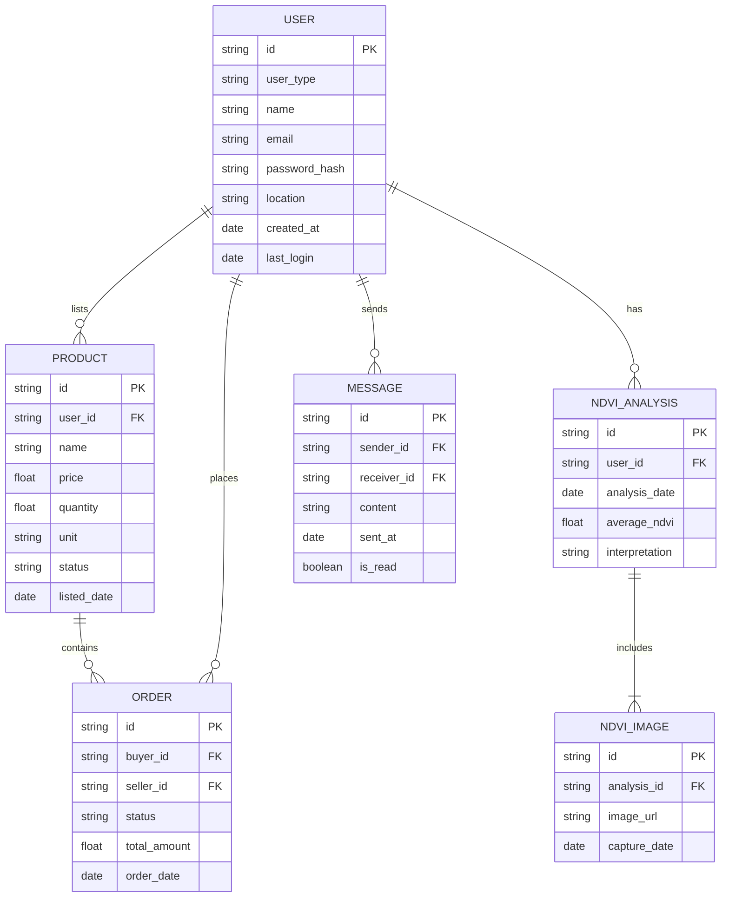
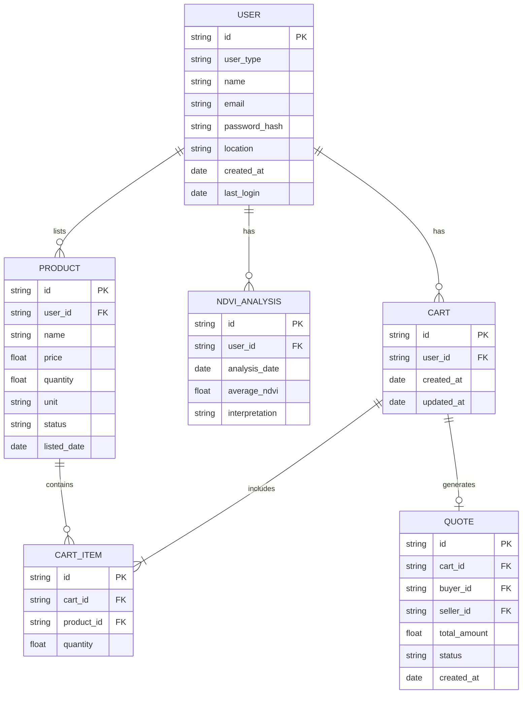
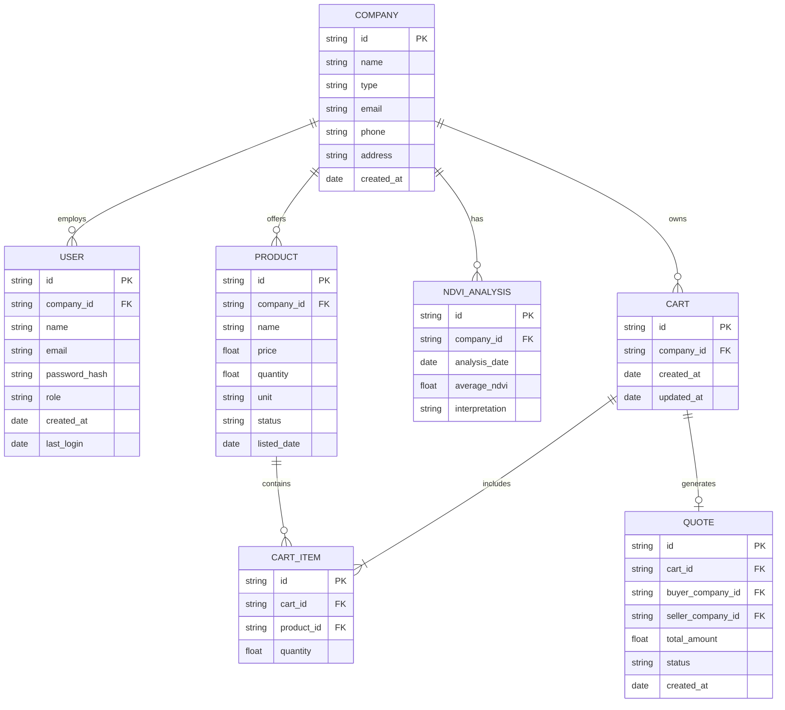
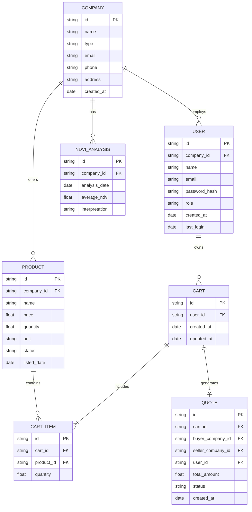
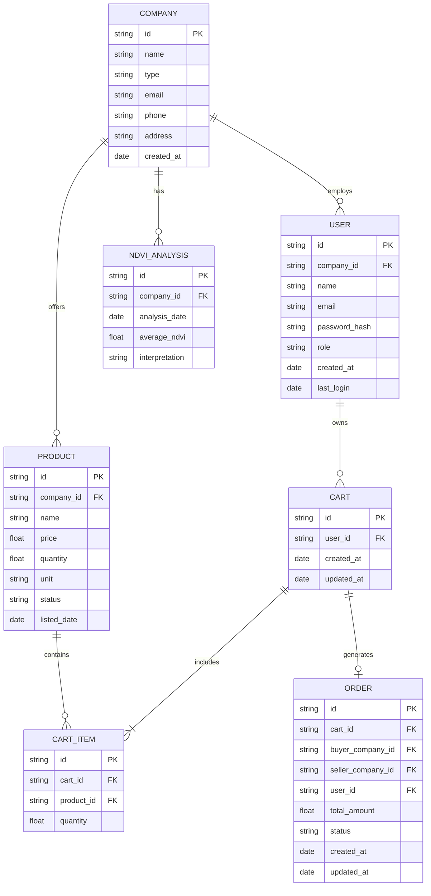
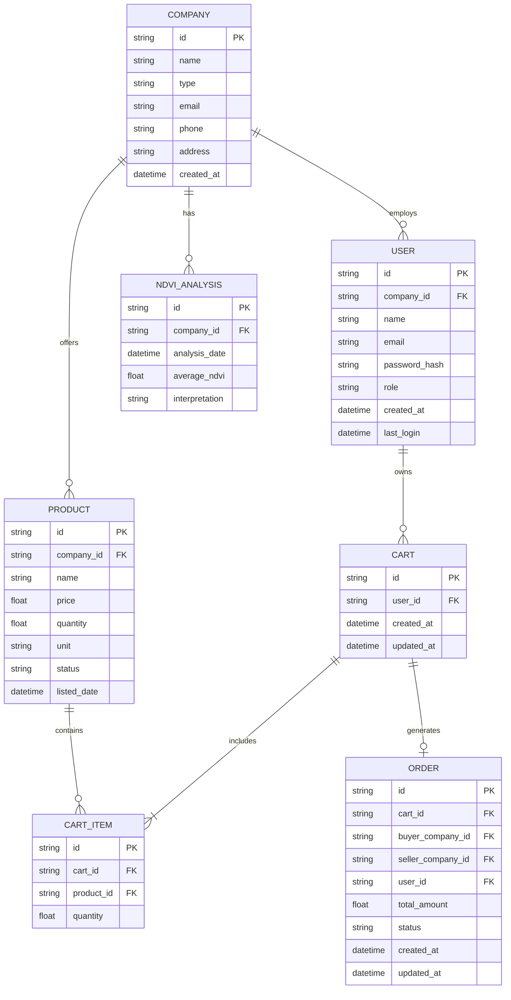

### Yo:

Bien, crees que podemos generar un modelo  de datos o aun te falta informacion?


### Claude:

Basándonos en la información que hemos discutido hasta ahora, creo que podemos generar un modelo de datos inicial para el MVP de AgriTech Connect. Sin embargo, es importante tener en cuenta que este modelo puede requerir ajustes a medida que avancemos en el desarrollo y obtengamos más detalles sobre las funcionalidades específicas.

Vamos a crear un modelo de datos básico que cubra las principales entidades y relaciones que hemos identificado:




Explicación del modelo de datos:

1. USER:
   - Representa tanto a agricultores como a compradores.
   - El campo user_type distingue entre agricultores y compradores.
   - Almacena información básica del usuario y datos de autenticación.

2. PRODUCT:
   - Representa los productos listados por los agricultores.
   - Vinculado al usuario (agricultor) que lo lista.
   - Incluye detalles como precio, cantidad y unidad de medida.

3. NDVI_ANALYSIS:
   - Representa un análisis NDVI realizado para un agricultor.
   - Vinculado al usuario (agricultor) que solicitó el análisis.
   - Incluye la fecha del análisis y un resumen de los resultados.

4. NDVI_IMAGE:
   - Representa las imágenes individuales asociadas a un análisis NDVI.
   - Permite almacenar múltiples imágenes por análisis (por ejemplo, series temporales).

5. ORDER:
   - Representa una transacción entre un comprador y un vendedor.
   - Vinculado tanto al comprador como al vendedor (ambos son usuarios).
   - Incluye el estado de la orden y el monto total.

6. MESSAGE:
   - Representa los mensajes enviados entre usuarios.
   - Permite la comunicación directa entre agricultores y compradores.

Consideraciones adicionales:

1. Usamos strings como IDs primarios, lo cual es común en DynamoDB para mayor flexibilidad.
2. Las relaciones están representadas mediante claves foráneas, aunque en DynamoDB estas se implementarían como atributos normales.
3. Para optimizar consultas en DynamoDB, podríamos necesitar tablas adicionales o índices secundarios, dependiendo de los patrones de acceso más comunes.

Este modelo de datos cubre las principales entidades y relaciones necesarias para nuestro MVP, incluyendo la gestión de usuarios, productos, análisis NDVI, órdenes y comunicación entre usuarios.

¿Te parece que este modelo de datos cubre las necesidades básicas de AgriTech Connect? ¿Hay alguna entidad o relación adicional que creas que deberíamos incluir o modificar?


### Yo:

me parece que para un mvp podemos no tener el sistema de mensajes y permitir que los usuarios simplemente se comuniquen por correo electrónico, por lo que haría que los usuarios puedan seleccionar los productos por ejemplo tipo carro de compras, luego simplemente se envíe un correo con la cotización de esos productos y que le llegue tambien la información al agricultor para comunicarse


### Claude:

Tienes toda la razón. Para un MVP, es importante enfocarse en las funcionalidades esenciales y simplificar donde sea posible. Tu sugerencia de eliminar el sistema de mensajes interno y utilizar el correo electrónico es una excelente manera de reducir la complejidad del sistema inicial. Vamos a ajustar nuestro modelo de datos para reflejar este enfoque más simplificado.




Explicación de los cambios en el modelo de datos simplificado:

1. Eliminamos la entidad MESSAGE, ya que la comunicación se realizará por correo electrónico.

2. Reemplazamos ORDER por QUOTE:
   - QUOTE representa una cotización generada a partir del carrito de compras.
   - Incluye información sobre el comprador, el vendedor y el monto total.
   - El status puede indicar si la cotización está pendiente, aceptada, rechazada, etc.

3. Agregamos CART y CART_ITEM:
   - CART representa el carrito de compras de un usuario.
   - CART_ITEM representa los productos individuales en el carrito y sus cantidades.

4. Mantuvimos USER, PRODUCT y NDVI_ANALYSIS sin cambios.

Este modelo simplificado permite:

1. Los usuarios (compradores) pueden agregar productos a su carrito.
2. Cuando estén listos, pueden generar una cotización basada en los items de su carrito.
3. El sistema puede usar esta información para enviar correos electrónicos tanto al comprador como al agricultor con los detalles de la cotización.
4. Los agricultores pueden ver las cotizaciones pendientes y contactar a los compradores por correo electrónico.

Consideraciones adicionales:

1. Podríamos necesitar almacenar las direcciones de correo electrónico de los usuarios de manera más explícita para facilitar la comunicación.
2. Puede ser útil agregar un campo en QUOTE para almacenar notas o requisitos especiales del comprador.
3. Dependiendo de cómo implementemos la funcionalidad de correo electrónico, podríamos necesitar una tabla adicional para rastrear los correos enviados.

Este modelo simplificado se alinea mejor con el concepto de MVP, reduciendo la complejidad del sistema inicial mientras aún proporciona las funcionalidades esenciales para conectar agricultores y compradores.

¿Te parece que este modelo simplificado se ajusta mejor a tus expectativas para el MVP? ¿Hay algún aspecto adicional que crees que deberíamos considerar o modificar?


### Yo:

corrijamos algo, la entidad principal es la company que no has creado, los usuarios pertenecen a una company


### Claude:

Excelente observación. Tienes razón, la entidad COMPANY es fundamental en nuestro modelo y debemos incluirla. Vamos a ajustar nuestro modelo de datos para reflejar esta estructura organizacional, donde los usuarios pertenecen a una compañía. Esto nos permitirá manejar mejor los diferentes tipos de organizaciones (agricultores y compradores) en nuestro sistema.




Explicación de los cambios en el modelo de datos basado en compañías:

1. Agregamos la entidad COMPANY:
   - Representa tanto a las organizaciones de agricultores como a las de compradores.
   - Incluye información básica de la compañía como nombre, tipo (agricultor o comprador), email, teléfono y dirección.

2. Modificamos USER:
   - Ahora los usuarios están asociados a una compañía mediante company_id.
   - Agregamos un campo 'role' para definir el rol del usuario dentro de la compañía (por ejemplo, admin, vendedor, etc.).

3. Actualizamos las relaciones:
   - PRODUCT ahora está asociado directamente a COMPANY en lugar de USER.
   - NDVI_ANALYSIS está asociado a COMPANY, ya que los análisis se realizan para los campos de la compañía, no para usuarios individuales.
   - CART está asociado a COMPANY, permitiendo que múltiples usuarios de la misma compañía puedan acceder y modificar el carrito.

4. Ajustamos QUOTE:
   - Ahora incluye buyer_company_id y seller_company_id para representar las compañías involucradas en la cotización.

Este modelo basado en compañías ofrece varias ventajas:

1. Mejor representación de la realidad del negocio, donde las transacciones ocurren entre compañías, no individuos.
2. Permite que múltiples usuarios de una misma compañía puedan gestionar productos, carritos y cotizaciones.
3. Facilita la implementación de permisos basados en roles dentro de cada compañía.
4. Simplifica el manejo de los análisis NDVI, asociándolos directamente a la compañía agrícola.

Consideraciones adicionales:

1. Podríamos necesitar agregar campos adicionales en COMPANY para distinguir entre compañías agrícolas y compradoras, o para almacenar información específica de cada tipo.
2. Dependiendo de los requisitos específicos, podríamos necesitar una entidad separada para manejar los campos agrícolas de cada compañía.
3. Podrían ser necesarios índices adicionales en DynamoDB para optimizar consultas comunes, como buscar todos los productos de una compañía o todas las cotizaciones para una compañía compradora.

¿Te parece que este modelo basado en compañías se ajusta mejor a la estructura organizacional que tienes en mente para AgriTech Connect? ¿Hay algún aspecto adicional de las compañías o las relaciones entre entidades que crees que deberíamos considerar?


### Yo:
porque el carro está asociado a company?


### Claude:

Tienes razón en cuestionar esa asociación. He cometido un error al asociar el carrito directamente a la compañía. Vamos a corregir esto, ya que el carrito debería estar asociado al usuario individual, no a la compañía. Esto permitirá una experiencia de compra más personalizada y evitará confusiones entre diferentes usuarios de la misma compañía.

Hagamos una corrección en nuestro modelo de datos:




Explicación de los cambios:

1. CART:
   - Ahora está asociado directamente al USER en lugar de COMPANY.
   - Cambiamos company_id FK por user_id FK.

2. QUOTE:
   - Agregamos user_id FK para rastrear qué usuario específico generó la cotización.

Estos cambios ofrecen las siguientes ventajas:

1. Experiencia de compra personalizada: Cada usuario tiene su propio carrito, evitando confusiones entre diferentes empleados de la misma compañía.
2. Mejor trazabilidad: Podemos rastrear qué usuario específico creó cada cotización, manteniendo al mismo tiempo la información de la compañía.
3. Flexibilidad: Permite que diferentes usuarios de la misma compañía compradora puedan tener carritos separados y generar cotizaciones independientes.

El resto del modelo permanece igual, manteniendo la estructura basada en compañías para los productos, análisis NDVI y la información general de la empresa.

Esta corrección asegura que:
- Los productos siguen asociados a las compañías (generalmente compañías agrícolas que los ofrecen).
- Los usuarios están asociados a compañías, pero tienen sus propios carritos individuales.
- Las cotizaciones mantienen la información tanto de las compañías involucradas como del usuario específico que la generó.

¿Te parece que este modelo corregido refleja mejor la relación entre usuarios, carritos y compañías? ¿Hay algún otro aspecto que crees que deberíamos ajustar o considerar?


### Yo:

cambia la cotizacion por orden de compra


### Claude:

Entendido. Vamos a cambiar la entidad QUOTE por ORDER (Orden de Compra), lo cual refleja mejor el proceso de compra en un contexto empresarial. Este cambio nos permitirá representar de manera más precisa el flujo de transacciones entre las compañías compradoras y vendedoras.

Aquí está el modelo de datos actualizado:




Explicación de los cambios:

1. Reemplazamos QUOTE por ORDER:
   - La entidad ORDER representa ahora una orden de compra formal entre las compañías.
   - Mantiene las relaciones con el carrito (CART), el usuario que la creó (USER), y las compañías compradora y vendedora (COMPANY).

2. Ajustes en ORDER:
   - Añadimos un campo updated_at para rastrear las actualizaciones en el estado de la orden.
   - El campo status ahora podría incluir estados como "pendiente", "aprobada", "en proceso", "enviada", "completada", etc.

Estos cambios ofrecen las siguientes ventajas:

1. Mejor representación del proceso de compra B2B: Una orden de compra es un documento más formal y apropiado para transacciones entre empresas.
2. Mayor claridad en el flujo de trabajo: El cambio de cotización a orden de compra implica un compromiso más firme en la transacción.
3. Flexibilidad para implementar un flujo de aprobación: Con una orden de compra, podemos implementar fácilmente un proceso de aprobación dentro de la empresa compradora si es necesario.
4. Mejor seguimiento de las transacciones: El campo updated_at nos permite rastrear la evolución de la orden a lo largo del tiempo.

Consideraciones adicionales:

1. Podríamos necesitar una entidad adicional para ORDER_ITEM si queremos mantener un registro detallado de los productos específicos en cada orden, especialmente si los precios o cantidades pueden cambiar después de que la orden se crea a partir del carrito.
2. Dependiendo de los requisitos del negocio, podríamos necesitar campos adicionales en ORDER, como fecha de entrega esperada, términos de pago, etc.
3. Sería útil considerar la implementación de un sistema de notificaciones para informar a los usuarios y compañías sobre cambios en el estado de las órdenes.

Este modelo actualizado proporciona una base sólida para implementar un sistema de comercio electrónico B2B para productos agrícolas, manteniendo la funcionalidad de análisis NDVI para las compañías agrícolas.

¿Te parece que este modelo con órdenes de compra se ajusta mejor a las necesidades de AgriTech Connect? ¿Hay algún aspecto adicional del proceso de compra o de las relaciones entre entidades que crees que deberíamos considerar?


### Yo:

ahora vamos con 3. Modelo de Datos
3.1. Diagrama del modelo de datos:
Recomendamos usar mermaid para el modelo de datos, y utilizar todos los parámetros que permite la sintaxis para dar el máximo detalle, por ejemplo las claves primarias y foráneas.
3.2. Descripción de entidades principales:
Recuerda incluir el máximo detalle de cada entidad, como el nombre y tipo de cada atributo, descripción breve si procede, claves primarias y foráneas, relaciones y tipo de relación, restricciones (unique, not null…), etc.


### Claude:

Entendido. Voy a proporcionar el modelo de datos utilizando Mermaid para el diagrama y una descripción detallada de las entidades principales.

```markdown
# 3. Modelo de Datos

## 3.1. Diagrama del modelo de datos



## 3.2. Descripción de entidades principales

### COMPANY
- **id** (string, PK): Identificador único de la compañía
- **name** (string, NOT NULL): Nombre de la compañía
- **type** (string, NOT NULL): Tipo de compañía (e.g., "agricultor", "comprador")
- **email** (string, UNIQUE, NOT NULL): Correo electrónico de contacto principal
- **phone** (string): Número de teléfono
- **address** (string): Dirección física
- **created_at** (datetime, NOT NULL): Fecha y hora de creación del registro

Relaciones:
- Una COMPANY puede tener muchos USER (1:N)
- Una COMPANY puede ofrecer muchos PRODUCT (1:N)
- Una COMPANY puede tener muchos NDVI_ANALYSIS (1:N)

### USER
- **id** (string, PK): Identificador único del usuario
- **company_id** (string, FK, NOT NULL): ID de la compañía a la que pertenece el usuario
- **name** (string, NOT NULL): Nombre completo del usuario
- **email** (string, UNIQUE, NOT NULL): Correo electrónico del usuario
- **password_hash** (string, NOT NULL): Hash de la contraseña
- **role** (string, NOT NULL): Rol del usuario en la compañía
- **created_at** (datetime, NOT NULL): Fecha y hora de creación del usuario
- **last_login** (datetime): Última fecha y hora de inicio de sesión

Relaciones:
- Un USER pertenece a una COMPANY (N:1)
- Un USER puede tener muchos CART (1:N)

### PRODUCT
- **id** (string, PK): Identificador único del producto
- **company_id** (string, FK, NOT NULL): ID de la compañía que ofrece el producto
- **name** (string, NOT NULL): Nombre del producto
- **price** (float, NOT NULL): Precio por unidad
- **quantity** (float, NOT NULL): Cantidad disponible
- **unit** (string, NOT NULL): Unidad de medida (e.g., "kg", "unidad")
- **status** (string, NOT NULL): Estado del producto (e.g., "disponible", "agotado")
- **listed_date** (datetime, NOT NULL): Fecha y hora en que se listó el producto

Relaciones:
- Un PRODUCT es ofrecido por una COMPANY (N:1)
- Un PRODUCT puede estar en muchos CART_ITEM (1:N)

### NDVI_ANALYSIS
- **id** (string, PK): Identificador único del análisis NDVI
- **company_id** (string, FK, NOT NULL): ID de la compañía asociada al análisis
- **analysis_date** (datetime, NOT NULL): Fecha y hora del análisis
- **average_ndvi** (float, NOT NULL): Valor promedio del NDVI
- **interpretation** (string): Interpretación textual del resultado del NDVI

Relaciones:
- Un NDVI_ANALYSIS pertenece a una COMPANY (N:1)

### CART
- **id** (string, PK): Identificador único del carrito
- **user_id** (string, FK, NOT NULL): ID del usuario dueño del carrito
- **created_at** (datetime, NOT NULL): Fecha y hora de creación del carrito
- **updated_at** (datetime, NOT NULL): Última fecha y hora de actualización del carrito

Relaciones:
- Un CART pertenece a un USER (N:1)
- Un CART puede tener muchos CART_ITEM (1:N)
- Un CART puede generar una ORDER (1:1)

### CART_ITEM
- **id** (string, PK): Identificador único del ítem en el carrito
- **cart_id** (string, FK, NOT NULL): ID del carrito al que pertenece
- **product_id** (string, FK, NOT NULL): ID del producto en el carrito
- **quantity** (float, NOT NULL): Cantidad del producto en el carrito

Relaciones:
- Un CART_ITEM pertenece a un CART (N:1)
- Un CART_ITEM se refiere a un PRODUCT (N:1)

### ORDER
- **id** (string, PK): Identificador único de la orden
- **cart_id** (string, FK, NOT NULL): ID del carrito que generó la orden
- **buyer_company_id** (string, FK, NOT NULL): ID de la compañía compradora
- **seller_company_id** (string, FK, NOT NULL): ID de la compañía vendedora
- **user_id** (string, FK, NOT NULL): ID del usuario que generó la orden
- **total_amount** (float, NOT NULL): Monto total de la orden
- **status** (string, NOT NULL): Estado de la orden (e.g., "pendiente", "aprobada", "rechazada")
- **created_at** (datetime, NOT NULL): Fecha y hora de creación de la orden
- **updated_at** (datetime, NOT NULL): Última fecha y hora de actualización de la orden

Relaciones:
- Una ORDER es generada por un CART (N:1)
- Una ORDER está asociada a una compañía compradora (N:1)
- Una ORDER está asociada a una compañía vendedora (N:1)
- Una ORDER es creada por un USER (N:1)


Este modelo de datos proporciona una estructura robusta para el MVP de AgriTech Connect, capturando las relaciones esenciales entre empresas, usuarios, productos, carritos de compra y órdenes. También incluye la entidad NDVI_ANALYSIS para manejar los datos de análisis de cultivos. Las claves primarias y foráneas están claramente definidas, y se han incluido detalles sobre los tipos de datos y algunas restricciones básicas.